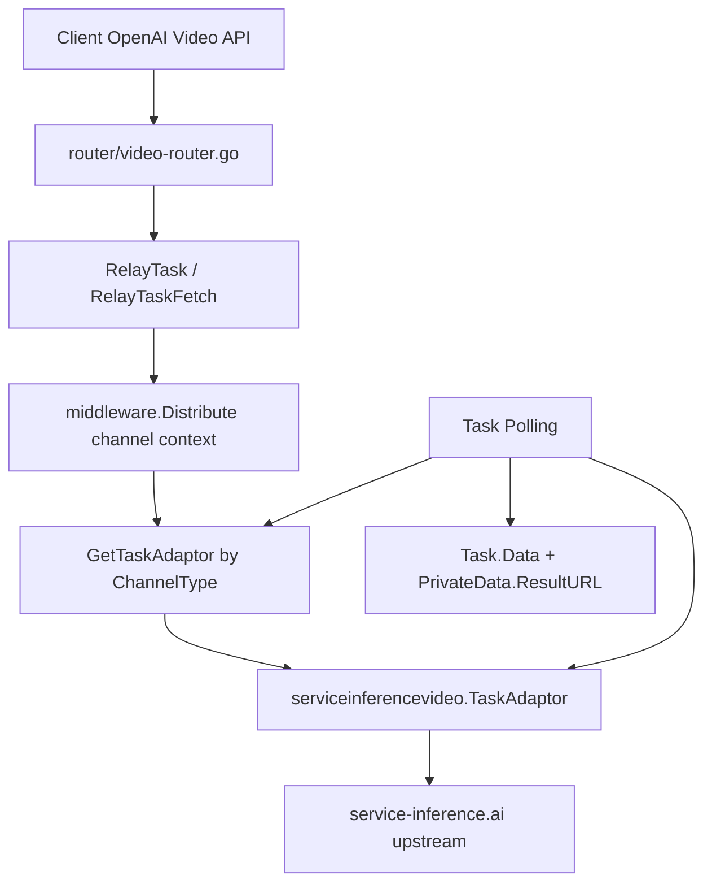

# service-inference.ai 视频 Task Adaptor 技术方案

## 0. 需求类型判定

类型：
- [ ] 新功能（New Feature）
- [x] 现有功能迭代，可以补充现有功能信息（Enhancement）
- [ ] 系统重构（Refactor）

原因：
- 这是在 `new-api` 现有异步视频任务链路中新增一个下游 provider 协议变体。
- 对外继续复用现有 OpenAI Video compatible surface，不新增用户侧 service-inference.ai 私有路由。
- 需要新增 ChannelType、task adaptor、后台渠道入口和测试，但不涉及数据库结构迁移。

## 0.1 方案档位判定

档位：
- [ ] 轻量方案（Lite）
- [x] 标准方案（Standard）
- [ ] 完整方案（Full）

原因：
- 本次不是单文件修复，涉及后端渠道枚举、provider task adaptor、轮询数据语义、计费 usage 传递、default / classic 两套后台渠道入口。
- 不新增公开 HTTP API，不修改数据库表，不涉及跨服务迁移，因此不升级为完整方案。
- 技术方案需覆盖服务端规范要求的事实证据链、能力盘点、API 复用、命名域、字段语义、包装边界、信任链和一致性扫描。

## 0.2 输入来源与缺失项

| 类型 | 来源位置 | 状态 | 说明 |
| --- | --- | --- | --- |
| 需求交付说明书（SDD Spec） | 当前 root：`docs/plan/2026-06-29-service-inference-video-adaptor-S1-1-service-inference-video-task-adaptor-01KW7W.md`；从 worktree 出发：`../../docs/plan/2026-06-29-service-inference-video-adaptor-S1-1-service-inference-video-task-adaptor-01KW7W.md` | 已读取 | 该 spec 属于上层 token168 编排输入，不属于 `new-api` 写入仓。 |
| owner 协议样例 | `#dev-discussion:t37` 消息 `01KW7WB0` | 已读取 | 给出 service-inference.ai create / list / get 三个上游接口样例。 |
| owner 裁决 | `#dev-discussion:t37` 消息 `01KW7WV4` | 已读取 | 确认公开模型 ID 统一、渠道命名、outputs[]、last_frame_url、不加删除 / 取消等口径。 |
| 契约核实 | `#dev-discussion:t37` 消息 `01KW7X0N`；项目代码 `dto/openai_video.go` | 已读取 | `dto.OpenAIVideo` 无原生 `last_frame_url` 字段，默认丢弃。 |
| 当前计划 | `docs/plans/2026-06-29_service-inference视频TaskAdaptor.md` | 已读取 | Phase 1 计划已通过 @arch Review。 |

缺失项：
- 无阻塞缺失项。
- service-inference.ai 官方失败态 / 运行态枚举未在样例中完整出现；按 owner 裁决进入技术方案补全：已在状态映射中用保守映射覆盖，未知态继续轮询。

## 0.3 技术方案阶段实际写集

本阶段实际写集：
- `docs/tech-design/service-inference-video-task-adaptor.md`
- `docs/plans/2026-06-29_service-inference视频TaskAdaptor.md`
- `docs/plan_index.md`

本阶段明确不写：
- Go adaptor 业务代码。
- Go 测试代码。
- default / classic 后台入口实现代码。
- `docs/api_contract.md` 或 OpenAPI 产物。

## 1. 背景与目标

业务背景：
- service-inference.ai 是 Seedance 2.0 视频下游渠道商，上游模型名为 `dreamina-seedance-2-0-260128`。
- 需求目标是让管理员可以在后台新增 `service-inference.ai` 视频渠道，通过 `model_mapping` 将现有公开 Seedance 2.0 模型映射到 service-inference.ai 上游模型名。

当前问题：
- 现有 DoubaoVideo adaptor 的 create / fetch 路径固定为 `/api/v3/contents/generations/tasks`，查询结果读取 `content.video_url`。
- 现有 XRTokenArkVideo adaptor 的路径为 `/v1/contents/generations/tasks`，查询结果读取顶层 `video_url`。
- service-inference.ai 使用 `/v1/video/generate`、`/v1/video/tasks/{id}`，响应包裹在 `{task:{...}}`，主结果在 `task.outputs[]`，不能通过现有 DoubaoVideo 或 XRTokenArkVideo 直接配置跑通。

目标指标：
- 新增 `service-inference.ai` 专用 ChannelType 和 task adaptor。
- 创建任务调用 `POST /v1/video/generate`，查询任务调用 `GET /v1/video/tasks/{taskId}`。
- create response 从 `task.id` 保存上游 task id。
- fetch response 成功时取 `task.outputs[0]` 作为主结果 URL；完整上游响应含全部 `outputs[]` 保留到 `Task.Data`。
- 继续对外使用现有 OpenAI Video 路由，不新增用户侧 service-inference.ai 兼容路由。
- DoubaoVideo 和 XRTokenArkVideo 行为不回退。

## 2. 事实真相与证据链

| 来源类型 | 来源位置 | 关键结果 | 设计结论 |
| --- | --- | --- | --- |
| 需求交付说明书（SDD Spec） | `docs/plan/2026-06-29-service-inference-video-adaptor-S1-1-service-inference-video-task-adaptor-01KW7W.md` | 要新增 service-inference.ai 专用 ChannelType / task adaptor；不新增 `api_profile`；不走 AdvancedCustom；默认对外继续使用 OpenAI Video surface；不新增删除 / 取消能力。 | 本方案只新增 provider adaptor 和后台渠道入口，不新增公开 HTTP API。 |
| 人类确认 | `#dev-discussion:t37` 消息 `01KW7WB0` | create：`POST /v1/video/generate`；list：`GET /v1/video/tasks`；get：`GET /v1/video/tasks/{id}`；create/get 响应包在 `{task:{...}}`；结果在 `outputs[]`；上游模型名 `dreamina-seedance-2-0-260128`。 | 需要独立 adaptor 覆盖路径、响应 wrapper、outputs[] 和模型映射。 |
| 人类确认 | `#dev-discussion:t37` 消息 `01KW7WV4` | 公开 SKU / 模型 ID 对外统一；渠道命名 `service-inference.ai`；状态枚举技术方案补全；outputs[] 默认取第 1 个且日志可查；last_frame_url 外壳不支持则丢弃；不加删除 / 取消。 | ChannelName 使用 `service-inference.ai`；状态映射和 outputs 追溯进入本方案；不新增 last_frame_url 外壳字段和删除能力。 |
| 人类确认 + 项目代码 | `#dev-discussion:t37` 消息 `01KW7X0N`；`dto/openai_video.go:16-31` | `dto.OpenAIVideo` 字段无原生 last_frame_url，只有 `Metadata map[string]any` 可承载自由字段。 | 默认丢弃 `last_frame_url`，仅在完整原始响应 `Task.Data` 中保留上游字段，不写 OpenAI Video 外壳。 |
| 项目代码 | `router/video-router.go:19-32` | 现有公开视频路由为 `POST /v1/video/generations`、`GET /v1/video/generations/:task_id`、`POST /v1/videos`、`GET /v1/videos/:task_id`。 | 用户侧入口复用现有路由；不新增 `POST /v1/video/generate` 等私有路径。 |
| 项目代码 | `relay/relay_adaptor.go:139-170` | `GetTaskAdaptor` 按 task platform / ChannelType 分发；DoubaoVideo / VolcEngine 使用 Doubao adaptor，XRTokenArkVideo 使用独立 adaptor。 | service-inference.ai 也应通过新增 ChannelType 分发到独立 task adaptor。 |
| 项目代码 | `relay/channel/task/doubao/adaptor.go:43-62`、`178-199` | Doubao 请求体包含 `content[]`、`duration`、`resolution`、`ratio`、`generate_audio`、`watermark`、`return_last_frame` 等字段；`BuildRequestBody` 支持 `model_mapping`。 | service-inference.ai 可复用 Doubao Seedance 请求体转换和计费估算。 |
| 项目代码 | `relay/channel/task/doubao/adaptor.go:123-125`、`237-260`、`306-341` | Doubao create / fetch 路径是 `/api/v3/contents/generations/tasks`，成功读取 `content.video_url`，状态成功仅包含 `succeeded`。 | service-inference.ai 不能复用 Doubao adaptor 的 URL 和响应解析。 |
| 项目代码 | `relay/channel/task/xrtokenarkvideo/adaptor.go:65-147`、`159-193` | XRToken adaptor 可复用 Doubao 请求体，但路径是 `/v1/contents/generations/tasks`，响应读取顶层 `video_url`。 | XRToken 可作为薄 adaptor 结构参考，但 service-inference.ai 仍需独立响应结构。 |
| 项目代码 | `service/task_polling.go:452-485` | 轮询读取上游响应后调用 adaptor `ParseTaskResult`，随后 `task.Data = redactVideoResponseBody(responseBody)` 保存完整响应。 | 完整 `outputs[]` 可通过原始上游响应进入 `Task.Data`，无需新增字段。 |
| 项目代码 | `service/task_polling.go:527-541` | 任务成功时，`TaskInfo.Url` 非空则写入 `task.PrivateData.ResultURL`，空则构建 proxy URL。 | adaptor 成功时只需把 `outputs[0]` 写入 `TaskInfo.Url`。 |
| 项目代码 | `service/task_polling.go:584-588`、`relay/common/relay_info.go` | 成功终态调用完成结算；`TaskInfo` 支持 CompletionTokens / TotalTokens。 | service-inference.ai usage 应在成功解析时传入 TaskInfo，用于完成结算。 |
| 项目代码 | `constant/channel.go:54-60`、`64-167`、`169-226` | 当前 `ChannelTypeXRTokenArkVideo = 101`，`ChannelTypeDummy = 102`；`ChannelBaseURLs` 已到索引 101；`ChannelTypeNames` 已有 XRToken。 | service-inference.ai 建议使用 `102`，同时将 `ChannelTypeDummy` 后移到 `103`，并补 `ChannelBaseURLs[102]` 与 `ChannelTypeNames`。 |
| 项目代码 | `model/channel.go:23-42`、`model/channel.go` 的 `GetBaseURL` 使用点来自 `service/task_polling.go:435-438` | 渠道有 `BaseURL` 和 `ModelMapping`；轮询空 base URL 时直接按 `constant.ChannelBaseURLs[ch.Type]` 下标读取。 | 新增 ChannelType 必须保证 `ChannelBaseURLs` 下标安全。 |
| 项目代码 | `web/default/src/features/channels/constants.ts:24-87` | default 后台渠道类型和展示顺序在 `CHANNEL_TYPES` / `CHANNEL_TYPE_DISPLAY_ORDER` 维护，已有 `101: XRTokenArkVideo`。 | 新增 service-inference.ai 后必须同步 default 渠道类型和排序。 |
| 项目代码 | `web/default/src/features/channels/lib/channel-utils.ts:47-123` | default 后台图标按数字 ChannelType 映射，XRTokenArkVideo 映射 Doubao 图标。 | service-inference.ai 默认映射 Doubao 图标。 |
| 项目代码 | `web/classic/src/constants/channel.constants.js:20-197` | classic 后台渠道下拉在 `CHANNEL_OPTIONS` 维护，已有 XRTokenArkVideo。 | 新增 service-inference.ai 后必须同步 classic 渠道下拉。 |
| 项目代码 | `web/classic/src/helpers/render.jsx:404-406` | classic 后台 DoubaoVideo / XRTokenArkVideo 复用 Doubao 图标。 | service-inference.ai 默认在同一分支复用 Doubao 图标。 |
| 实际执行结果 | `python3 ../../harness-engineering/tools/harness_env.py doctor --profile bootstrap` | 输出 `bootstrap: pass`。 | 基础环境门禁通过。 |
| 实际执行结果 | `codegraph sync && codegraph status` | CodeGraph project 为当前 worktree，`Index is up to date`。 | CodeGraph 可作为定位辅助，最终结论仍以源码和测试为准。 |

## 2.1 现有系统

已有模块：
- `router/video-router.go`：公开视频任务路由。
- `controller.RelayTask` / `controller.RelayTaskFetch`：现有 task controller 入口。
- `relay/relay_adaptor.go`：task adaptor 分发。
- `relay/channel/task/doubao`：DoubaoVideo task adaptor。
- `relay/channel/task/xrtokenarkvideo`：XRTokenArkVideo 薄 task adaptor。
- `service/task_polling.go`：异步视频任务轮询与结果写回。
- `web/default/src/features/channels/**`：default 后台渠道入口。
- `web/classic/src/**`：classic 后台渠道入口。

当前流程：
1. 用户调用现有 OpenAI Video 路由提交视频任务。
2. `middleware.Distribute()` 选择渠道并写入 channel context。
3. `RelayTask` 根据 ChannelType 获取 task adaptor。
4. task adaptor 构造上游请求并解析 create response，返回上游 task id。
5. 本地任务保存公开 task id 和 `PrivateData.UpstreamTaskID`。
6. 轮询任务按 platform / channel 查询上游状态。
7. adaptor 解析上游响应为 `TaskInfo`。
8. `service/task_polling.go` 写入 `Task.Data`、状态、进度、结果 URL、结算或退款。
9. 用户查询现有 OpenAI Video 路由，adaptor 转换为 OpenAI Video 外壳。

## 2.2 变更点

新增：
- `service-inference.ai` ChannelType。
- `relay/channel/task/serviceinferencevideo` 包。
- `GetTaskAdaptor` 分发分支。
- default / classic 后台渠道入口。
- 对应 Go 单元测试和前端常量测试或静态断言。

修改：
- `constant/channel.go`：新增 ChannelType、默认 base URL、ChannelTypeName，并后移 `ChannelTypeDummy`。
- `relay/relay_adaptor.go`：注册 service-inference.ai task adaptor。
- default / classic 后台渠道常量与图标映射。

修改摘要：
- 改动对象：内部 provider adaptor 与后台配置入口。
- 主要影响方向：仅选中 service-inference.ai 渠道时走新上游协议；已有 DoubaoVideo / XRTokenArkVideo 路径不变。

删除：
- 无。

不变：
- 用户侧 OpenAI Video API surface。
- 数据库表结构。
- `docs/api_contract.md`。
- DoubaoVideo `/api/v3` adaptor。
- XRTokenArkVideo adaptor。
- 删除 / 取消能力。

## 2.3 兼容性策略

- 向后兼容：新增 ChannelType，不改变现有 ChannelType 数值。
- Feature Flag 控制：不新增开关；渠道启用由后台渠道配置控制。
- 灰度发布：管理员可先创建禁用状态或低权重渠道，配置 `model_mapping` 后再启用。
- 回滚策略：禁用或删除 service-inference.ai 渠道配置；代码回滚删除新增 ChannelType / adaptor / 后台入口即可，不涉及数据迁移。

## 2.4 数据迁移

- 是否需要迁移：不需要。
- 迁移方式：无。
- 是否影响历史数据：不影响。历史任务保持原 platform / ChannelType；新增 ChannelType 只影响后续新建渠道和新任务。

## 3. 影响范围摘要

- 功能边界：新增 service-inference.ai provider task adaptor；后台可选择新增该渠道。
- 用户边界：普通用户继续使用现有 OpenAI Video 路由和公开模型 ID；不会看到 service-inference.ai 私有路径。
- 数据边界：不改表结构；新增任务仍写入现有 `tasks` 表，完整上游响应进入 `Task.Data`，主结果 URL 进入 `PrivateData.ResultURL`。
- 接口 / 依赖边界：新增对 service-inference.ai 上游 API 的外部 HTTP 调用；不新增内部或公开 HTTP API。
- 综合判断：中等风险，主要风险在 ChannelType 下标、状态映射、outputs[] 追溯和后台入口遗漏。

## 3.1 现有能力盘点表

| 能力对象 | 类型 | 证据链 | 可复用范围 | 决策结论 | 未闭合项 | 下一步 owner |
| --- | --- | --- | --- | --- | --- | --- |
| OpenAI Video 公开视频路由 | API | 项目代码：`router/video-router.go:19-32`；已有 create / fetch 路由 | 用户侧提交 / 查询入口 | 复用 | 无 | @doer |
| task adaptor 分发 | 适配层 | 项目代码：`relay/relay_adaptor.go:139-170` | 按 ChannelType 接入新 adaptor | 扩展 | 无 | @doer |
| Doubao Seedance 请求体转换 | 适配层 | 项目代码：`relay/channel/task/doubao/adaptor.go:43-62`、`178-199` | content / duration / resolution / ratio / generate_audio / watermark / return_last_frame | 包装 | 需编码时选择最小导出或组合复用 | @doer |
| DoubaoVideo URL 与响应解析 | 适配层 | 项目代码：`relay/channel/task/doubao/adaptor.go:123-125`、`237-260`、`306-341` | 不复用路径和结果解析 | 新增 | 无 | @doer |
| XRTokenArkVideo 薄 adaptor | 适配层 | 项目代码：`relay/channel/task/xrtokenarkvideo/adaptor.go:42-147` | 薄 adaptor 结构和 Doubao 请求体复用方式 | 包装 | 无 | @doer |
| 任务轮询写回 | service | 项目代码：`service/task_polling.go:452-541` | 保存原始响应、状态、主 URL | 复用 | 无 | @doer |
| 失败退款 / 成功结算 | service | 项目代码：`service/task_polling.go:512-588` | 失败退款、成功结算、usage 传递 | 复用 | 无 | @doer |
| `model_mapping` | 模型 / 渠道配置 | 项目代码：`model/channel.go:42`、`relay/channel/task/doubao/adaptor.go:189-193` | 公开模型名映射上游模型名 | 复用 | 无 | @doer |
| default 后台渠道入口 | 后台 | 项目代码：`web/default/src/features/channels/constants.ts:24-87`、`lib/channel-utils.ts:47-123` | 渠道下拉、排序、图标 | 扩展 | 无 | @doer |
| classic 后台渠道入口 | 后台 | 项目代码：`web/classic/src/constants/channel.constants.js:20-197`、`web/classic/src/helpers/render.jsx:404-406` | 渠道下拉、图标 | 扩展 | 无 | @doer |
| 删除 / 取消任务 | API / 适配层 | SDD Spec 与 owner 裁决：不加删除 / 取消；现有 TaskAdaptor 无 delete/cancel 动作 | 本次不涉及 | 复用现状 | 无 | @xy zh / @arch |

## 3.2 API 复用矩阵

| 需求能力 | 候选既有 API / 契约 | 证据链 | 复用结论 | 不复用 / 不扩展证据 | 影响面 | 未闭合项 | 下一步 owner |
| --- | --- | --- | --- | --- | --- | --- | --- |
| 用户提交视频任务 | `POST /v1/video/generations`、`POST /v1/videos` | 项目代码：`router/video-router.go:23-31`；SDD Spec 默认保持 OpenAI Video surface | 复用 | 不需要新增 service-inference.ai 私有 create 路由 | 兼容 | 无 | @doer |
| 用户查询视频任务 | `GET /v1/video/generations/:task_id`、`GET /v1/videos/:task_id` | 项目代码：`router/video-router.go:23-31` | 复用 | 不需要新增 service-inference.ai 私有 get 路由 | 兼容 | 无 | @doer |
| service-inference.ai create 上游调用 | DoubaoVideo `/api/v3/contents/generations/tasks`；XRToken `/v1/contents/generations/tasks` | owner 协议样例：`POST /v1/video/generate`；项目代码显示两者路径均不同 | 新增 | 路径不同，response wrapper 不同 | 仅新渠道 | 无 | @doer |
| service-inference.ai fetch 上游调用 | DoubaoVideo `/api/v3/.../{id}`；XRToken `/v1/contents/.../{id}` | owner 协议样例：`GET /v1/video/tasks/{id}`；结果字段 `task.outputs[]` | 新增 | 路径、wrapper、结果字段都不同 | 仅新渠道 | 无 | @doer |
| service-inference.ai list 上游调用 | 无现有公开 API | owner 协议样例：`GET /v1/video/tasks` 返回 `{tasks[], total, totalPages}` | 本次不默认实现，保留为查询兜底候选 | fetch by id 已满足轮询；列表端点没有 task id 精准查询优势 | 无公开影响 | 若后续真实上游 get 不稳定再补 | @arch |
| 删除 / 取消 | 无现有公开视频删除 API | owner 裁决 `01KW7WV4`：不加删除 / 取消 | 复用现状 | 不进入本任务 | 兼容 | 无 | @xy zh |
| OpenAI Video 外壳 last_frame_url | `dto.OpenAIVideo.Metadata` | `dto/openai_video.go:16-31` 无原生字段；owner 裁决外壳不支持则丢弃 | 复用现状 | 不新增公开响应字段 | 兼容 | 无 | @doer |

## 3.3 命名域矩阵

| 使用场景 | 业务领域 | 功能模块 | 后端实现标识 | API path | 权限 key | 表名 | 包 / 模块名 | 服务边界证据链 | 结论 |
| --- | --- | --- | --- | --- | --- | --- | --- | --- | --- |
| service-inference.ai 视频渠道 | AI 视频生成 | provider task adaptor | `ServiceInferenceVideo` / `serviceinferencevideo` / `service-inference.ai` | 不新增用户侧 path；上游 path 为 `/v1/video/generate`、`/v1/video/tasks/{id}` | 复用现有 token / channel 鉴权 | 复用 `tasks`、`channels` | `relay/channel/task/serviceinferencevideo` | SDD Spec 要求渠道命名 `service-inference.ai` 且新增专用 adaptor | 采用 |
| 公开模型 ID | 模型目录 / 计费 / 用户输入 | model mapping | 现有 Seedance 2.0 公开模型 ID | 现有 OpenAI Video path | 复用现有模型权限 | 复用现有模型配置 | 不新增包 | owner 裁决公开 SKU / 模型 ID 对外统一 | 采用 |
| 上游模型名 | service-inference.ai provider | request payload | `dreamina-seedance-2-0-260128` | 上游 request body `model` | 上游 Bearer key | 不落表新增字段 | adaptor 请求体 | owner 协议样例与 SDD Spec 明确通过 `model_mapping` 映射 | 采用 |
| 后台渠道入口 | 管理后台 | channel type selector | `service-inference.ai` | 复用现有后台 channel API | 复用现有后台权限 | 复用 `channels` | default / classic constants | Phase 1 Review 要求后台可新增该渠道 | 采用 |

## 3.4 数据字段语义矩阵

| 字段 | 类型 | 单位 | NULL / NOT NULL | 默认值 | sentinel / 未知值 | 合法值冲突 | 采集 / 写入时点 | 历史数据 | 回滚 / 重复 | 响应表达 | 证据链 | 未闭合项 | owner |
| --- | --- | --- | --- | --- | --- | --- | --- | --- | --- | --- | --- | --- | --- |
| `Channel.Type` | int | 无 | NOT NULL | 后台选择 | 无 | `102` 当前是 `ChannelTypeDummy`，新增时必须把 Dummy 后移到 `103` | 管理员创建渠道 | 历史渠道不受影响 | 回滚前禁用或删除新渠道 | 后台渠道详情 | `constant/channel.go:54-60` | 无 | @doer |
| `Channel.BaseURL` | string | URL | 可空 | 空时用 `ChannelBaseURLs[102]` | 空表示使用默认 base URL | 不应指向 Doubao / XRToken base | 渠道创建 / 更新 | 历史渠道不受影响 | 可配置覆盖或禁用渠道 | 后台渠道详情 | `model/channel.go:35`、`service/task_polling.go:435-438` | 无 | @doer |
| `Channel.ModelMapping` | JSON string | 无 | 可空 | 空表示不映射 | 空 | 映射循环由既有逻辑处理；本任务不新增字段 | 管理员配置渠道；提交任务时读取 | 无迁移 | 重复配置按现有校验 | 不直接返回用户 | `model/channel.go:42`、`doubao/adaptor.go:189-193` | 无 | @doer |
| `Task.TaskID` | string | 无 | NOT NULL | `task_` 随机公开 ID | 无 | 不应写上游 id | 提交任务前生成 | 历史任务保持 | 重复查询按公开 task id | 用户侧 task id | `model/task.go:138-142`、`model/task.go:188-207` | 无 | @doer |
| `Task.PrivateData.UpstreamTaskID` | string | 无 | 可空 | 空时兼容旧任务用 `TaskID` | 空 | 必须写 `task.id`，不能写 wrapper 外空值 | create response 解析后写入 | 旧任务回退 `TaskID` | 回滚不改结构 | 不直接返回用户 | `model/task.go:99-127`、owner 样例 `task.id` | 无 | @doer |
| `Task.Data` | JSON | 无 | 可空 | 空 | 空 | 不应裁掉 `outputs[]`；仅按现有 redact 处理大体积视频字段 | 每次轮询读取 response 后写入 | 历史任务不受影响 | 重复轮询覆盖为最新响应 | 不直接完整返回用户 | `service/task_polling.go:485` | 无 | @doer |
| `Task.PrivateData.ResultURL` | string | URL | 可空 | 空 | 空表示无直接结果 URL | 成功时取 `outputs[0]`；空则由现有逻辑构建 proxy URL | fetch 成功解析后写入 | 历史任务兼容 `GetResultURL` | 重复成功 CAS 防止重复结算 | OpenAI Video `metadata.url` | `service/task_polling.go:527-541`、`model/task.go:129-136` | 无 | @doer |
| `task.status` | string | 无 | 可空；空按未知 | 空 | 未知态映射 `IN_PROGRESS` | 不能把未知态误判失败 | fetch response 解析 | 无结构影响 | 重复轮询继续推进 | OpenAI Video status | owner 样例；`model/task.go:15-31` | 官方枚举不完整，按保守映射 | @doer |
| `task.outputs[]` | []string | URL | 可空 | 空数组 | 空数组表示未完成或无结果 | 主 URL 只取 index 0；完整数组保留在 `Task.Data` | fetch response 解析 | 无结构影响 | 重复轮询覆盖最新完整响应 | `metadata.url` 使用第一个 | owner 裁决 `outputs[]` 默认取第 1 个且全量可查 | 无 | @doer |
| `task.usage.completion_tokens` / `total_tokens` | int | token | 可空 | 0 | 0 表示未知或未返回 | 不应与预扣倍率冲突；仅传给完成结算 | 成功 fetch response 解析 | 无结构影响 | 重复结算由终态 CAS 控制 | 不直接新增公开字段 | owner 样例；`service/task_polling.go:584-588` | 无 | @doer |
| `task.duration_seconds` | number / string | 秒 | 可空 | 空 | 空表示未知 | 与 Doubao / XRToken `duration` 名称不同 | create / fetch response 解析 | 无结构影响 | 重复轮询覆盖最新响应 | OpenAI Video `seconds` | owner 样例；`dto/openai_video.go:16-31` | 无 | @doer |
| `task.created_at` / `completed_at` | string | RFC3339 时间 | 可空 | 空 | 空表示上游未返回 | 不覆盖本地审计时间；只用于外壳展示可选 | create / fetch response 解析 | 无结构影响 | 重复轮询覆盖最新响应 | OpenAI Video `created_at` / `completed_at` | owner 样例；`dto/openai_video.go:16-31` | 无 | @doer |
| `task.last_frame_url` | string | URL | 可空 | 空 | 空 | 不进入 OpenAI Video 外壳 | fetch response 原样保存在 `Task.Data` | 无结构影响 | 回滚不影响表结构 | 默认不返回 | owner 裁决 + `dto/openai_video.go:16-31` | 无 | @doer |

## 3.5 既有能力包装边界矩阵

| 底层能力 | 适配 API / 包装层 | 权限 | 幂等 | 审计 | 状态映射 | 恢复路径 | 证据链 | 未闭合项 | owner |
| --- | --- | --- | --- | --- | --- | --- | --- | --- | --- |
| 用户提交视频任务 | 现有 `RelayTask` + service-inference.ai adaptor | 复用 `TokenAuth` + `Distribute` | 复用公开 task id 和预扣费流程；不新增幂等键 | 复用现有 task log / request log | create 后仍进入现有 task 状态流 | 禁用渠道或回滚 adaptor | `router/video-router.go:19-32`、`relay/relay_adaptor.go:139-170` | 无 | @doer |
| 用户查询视频任务 | 现有 `RelayTaskFetch` + `ConvertToOpenAIVideo` | 复用 task user 隔离 | GET 查询幂等 | 复用现有查询日志 | 本地 `TaskStatus` 转 OpenAI Video status | 回滚 adaptor 后历史数据仍保留 | `model/task.go:15-31`、`dto/openai_video.go:16-31` | 无 | @doer |
| 上游 create | `channel.DoTaskApiRequest` | 使用渠道 key | 上游是否幂等由 provider 负责；本地不重放 create | 复用 outbound 日志 | 只解析上游 task id，不设终态 | create 失败按现有错误返回 | `doubao/adaptor.go:201-234`、`xrtokenarkvideo/adaptor.go:88-123` | 无 | @doer |
| 上游 fetch | `service.GetHttpClientWithProxy` + adaptor `FetchTask` | 使用渠道 key 或 task private key | 轮询 GET 幂等 | `task.Data` 保存最新响应；日志可查 | 见状态映射表 | 未知态继续轮询；失败态触发既有退款 | `service/task_polling.go:452-588` | 无 | @doer |
| 模型名映射 | `model_mapping` + Doubao 请求体复用 | 渠道配置权限 | 无写副作用 | 现有 upstream / origin model 记录 | 不涉及状态 | 配置错误可改 mapping | `model/channel.go:42`、`doubao/adaptor.go:189-193` | 无 | @doer |
| 后台渠道入口 | default / classic channel constants | 复用后台权限 | 创建 / 更新渠道沿用现有接口 | 复用后台操作链路 | 不涉及 task 状态 | 回滚前端常量或禁用渠道 | default / classic 源码入口 | 无 | @doer |

## 3.6 信任链 / 统一上下文参数复用检查

| 上下文字段 / 信任链 | 既有解析链路 | 证据链 | 复用结论 | 新增或扩展理由 | 不可降级门禁 | owner |
| --- | --- | --- | --- | --- | --- | --- |
| 用户身份与 API Key | `middleware.TokenAuth()` | `router/video-router.go:19-32` | 复用 | 不新增用户侧接口 | 必须保持用户隔离和 token 权限 | @doer |
| 渠道选择上下文 | `middleware.Distribute()` 写入 channel context，`RelayInfo.InitChannelMeta` 读取 | `relay/common/relay_info.go:191-212` | 复用 | 不新增 header / query | 必须按选中渠道 Type 分发 | @doer |
| 上游鉴权 | 渠道 key / private key | `service/task_polling.go:446-455` | 复用 | provider 只需 Bearer key | 不在日志暴露 key | @doer |
| 模型名上下文 | `OriginModelName` / `UpstreamModelName` / `IsModelMapped` | `relay/common/relay_info.go:63-81`、`doubao/adaptor.go:189-193` | 复用 | 不新增模型 profile 字段 | 公开模型名不得被上游模型名替代 | @doer |
| 后台渠道配置权限 | 现有 channel 管理页面 | default / classic channel constants | 复用 | 只新增选项 | 不新增权限 key | @doer |
| 自定义范围字段 / 新 header | 无 | 本次不新增公开 API | 本次不涉及 | 无 | 不允许引入新信任链 | @doer |

## 3.7 一致性扫描结果

| 扫描项 | 命令 / 范围 | 命中结论 | 保留理由或清理动作 | owner |
| --- | --- | --- | --- | --- |
| `service-inference.ai` | `rg -n 'service-inference\\.ai' docs/tech-design/service-inference-video-task-adaptor.md` | 应命中渠道命名、写集、目标和后台入口说明 | 合法方案文本 | @doer |
| `/v1/video/generate` | `rg -n '/v1/video/generate' docs/tech-design/service-inference-video-task-adaptor.md` | 应命中上游 create 和不新增用户侧私有路由边界 | 合法方案文本 | @doer |
| `outputs[]` | `rg -n 'outputs\\[\\]' docs/tech-design/service-inference-video-task-adaptor.md` | 应命中字段语义和追溯说明 | 合法方案文本 | @doer |
| `last_frame_url` | `rg -n 'last_frame_url' docs/tech-design/service-inference-video-task-adaptor.md` | 应命中 owner 裁决和默认丢弃说明 | 合法方案文本 | @doer |
| `ChannelTypeDummy` | `rg -n 'ChannelTypeDummy' docs/tech-design/service-inference-video-task-adaptor.md` | 应命中下标安全说明 | 合法方案文本 | @doer |
| `docs/api_contract.md` | `rg -n 'docs/api_contract.md' docs/tech-design/service-inference-video-task-adaptor.md` | 应命中 contract-first 不更新依据 | 合法方案文本 | @doer |
| `TODO` | `rg -n 'TODO' docs/tech-design/service-inference-video-task-adaptor.md` | 期望仅命中本扫描项；不引入待办占位 | 保留扫描项本身 | @doer |
| `NULL|null` | `rg -n 'NULL|null' docs/tech-design/service-inference-video-task-adaptor.md` | 应命中字段语义矩阵；本次无 SQL DDL | 合法字段语义文本 | @doer |
| 新接口 / 新公开路由 | `rg -n '新接口|新公开路由|新增用户侧' docs/tech-design/service-inference-video-task-adaptor.md` | 仅在“不新增”语境出现 | 保留边界说明 | @doer |
| SQL 字段注释 | `rg -n 'CREATE TABLE|ALTER TABLE|COMMENT' docs/tech-design/service-inference-video-task-adaptor.md` | 不应命中 SQL DDL | 若命中非 SQL 文本，保留说明；无需 SQL lint | @doer |

## 3.8 待裁决项集中表

| 待裁决项 | 选项 | 证据链 | 推荐方案 | 阻塞状态 | owner |
| --- | --- | --- | --- | --- | --- |
| service-inference.ai list 端点是否作为 fetch 兜底 | A：只实现 get by id；B：get by id 失败时再 list 搜索；C：只实现 list | owner 样例同时提供 list 和 get；轮询已有明确 upstream task id | A。get by id 可精准查询，list 端点暂不进入默认实现；后续真实上游需要时再补 | 不阻塞 | @arch |
| default 后台 locale 是否补齐 `service-inference.ai` | A：仅补 `CHANNEL_TYPES` 常量；B：同步所有 locale 文件 | 现有 `CHANNEL_TYPES` 注释称 label 是 i18n key；但 XRTokenArkVideo 已在常量中存在，未检索到 locale 键仍可进入选项 | A。保持最小变更；若 Review 明确要求本地化，再追加 locale | 不阻塞 | @arch |

## 4. 需求交付说明书依据

### 4.1 功能需求

- 新增可配置的 service-inference.ai Seedance 2.0 视频渠道。
- 通过 `model_mapping` 将公开模型 ID 映射到上游 `dreamina-seedance-2-0-260128`。
- create 上游调用 `POST /v1/video/generate`。
- fetch 上游调用 `GET /v1/video/tasks/{taskId}`。
- create response 兼容 `{task:{id,...}}`。
- fetch response 兼容 `{task:{outputs[], usage, duration_seconds, created_at, completed_at, last_frame_url}}`。
- 成功时 `outputs[0]` 作为主结果 URL，完整 `outputs[]` 可追溯。
- 不加删除 / 取消能力。
- 不影响 DoubaoVideo 和 XRTokenArkVideo。
- 后台可新增 `service-inference.ai` 渠道。

### 4.2 非功能需求

- QPS：复用现有视频 task 轮询与渠道分发能力，不新增独立并发模型。
- 延迟：提交接口仍为异步任务创建，轮询间隔沿用现有系统任务。
- SLA：新增渠道失败只影响选中 service-inference.ai 渠道的任务。
- 一致性：终态更新使用现有 `UpdateWithStatus` CAS 与结算 / 退款门禁。
- 安全：复用渠道 key 和 proxy 设置，不新增公开鉴权字段。

## 5. 架构设计



分层说明：
- 路由层不新增 service-inference.ai 私有 path。
- relay adaptor 层新增 provider 协议适配。
- service 轮询层保持现有写回和结算语义。
- 后台入口只负责渠道类型选择和图标展示，不承载业务协议逻辑。

## 6. 核心流程设计

### 6.1 创建任务

1. 用户调用现有 `POST /v1/video/generations` 或 `POST /v1/videos`。
2. `Distribute()` 选中 service-inference.ai 渠道。
3. `GetTaskAdaptor` 根据 ChannelType 返回 `serviceinferencevideo.TaskAdaptor`。
4. adaptor 复用 Doubao Seedance 请求体转换。
5. 若配置了 `model_mapping`，将 body.model 改为 `dreamina-seedance-2-0-260128`。
6. 调用上游 `POST /v1/video/generate`。
7. 解析 response wrapper `task.id` 作为上游 task id。
8. 对用户返回公开 task id 的 OpenAI Video 外壳。

### 6.2 轮询任务

1. `service/task_polling.go` 按 channel / platform 扫描未完成任务。
2. adaptor 调用 `GET /v1/video/tasks/{taskId}`。
3. 解析 `{task:{...}}`。
4. `pending` / 运行态映射为未终态，继续轮询。
5. `completed` 映射成功，取 `outputs[0]` 为 `TaskInfo.Url`。
6. 完整 response 经过现有 `redactVideoResponseBody` 后写入 `Task.Data`。
7. `TaskInfo.Url` 写入 `PrivateData.ResultURL`。
8. `usage.completion_tokens`、`usage.total_tokens` 传给完成结算。

### 6.3 查询任务

1. 用户调用现有 `GET /v1/video/generations/:task_id` 或 `GET /v1/videos/:task_id`。
2. `RelayTaskFetch` 读取本地任务。
3. service-inference.ai adaptor 将 `Task.Data` 转为 OpenAI Video 外壳。
4. `metadata.url` 使用 `outputs[0]`；若原始响应没有 URL，回退 `originTask.GetResultURL()`。
5. 不输出 `last_frame_url` 独立字段。

### 6.4 异常流程

- 上游 create response 无 `task.id`：返回 `invalid_response`，不创建有效上游任务。
- 上游 fetch 429 或临时错误：沿用现有轮询错误处理，不直接改终态。
- 未知 status：映射 `IN_PROGRESS`，避免误失败退款。
- completed 但 `outputs[]` 为空：状态可成功，但 `TaskInfo.Url` 为空时现有逻辑构建 proxy URL；同时保留完整响应，便于排查上游缺字段。
- failed / canceled 等失败态：映射 `FAILURE`，写入上游 error message，触发既有失败退款。

## 7. 数据模型设计

本次不涉及新建表或修改已有表结构。

数据写入仍复用：
- `channels.type`
- `channels.base_url`
- `channels.model_mapping`
- `tasks.private_data`
- `tasks.data`
- `tasks.status`
- `tasks.progress`
- `tasks.fail_reason`

## 8. 接口设计与协议产物

本次不新增用户侧 HTTP API，不修改既有 HTTP API 契约，不更新 `docs/api_contract.md`，不生成 OpenAPI 产物。

依据：
- SDD Spec 明确默认对外继续保持现有 OpenAI Video `/v1/video/generations` surface。
- owner 裁决要求公开 SKU / 模型 ID 统一，不暴露渠道私有模型 ID。
- service-inference.ai 的 `POST /v1/video/generate`、`GET /v1/video/tasks`、`GET /v1/video/tasks/{id}` 是上游 provider API，不是本服务新增用户侧 API。
- 当前需求不加删除 / 取消能力。

接口协议产物表：

| 产物 | 默认路径 | 生成入口 / 来源 | 状态 | 证据链 | Coding 使用方式 |
| --- | --- | --- | --- | --- | --- |
| Markdown 接口协议 | `docs/api_contract.md` | 技术方案阶段产出 / 更新 | 本次不涉及 | SDD Spec 和 owner 裁决均要求默认不新增用户侧路由；项目代码已有 OpenAI Video 路由 | Coding 不改用户侧 handler / contract |
| OpenAPI 产物 | `api/openapi.yaml` | 由 Markdown 协议通过统一入口生成 | 本次不涉及 | 不新增或修改 HTTP API 契约 | Coding 不生成 OpenAPI |

若 owner 后续要求暴露 service-inference.ai 兼容路径，必须先退回技术方案阶段，补 `docs/api_contract.md`、路由、鉴权、错误码、接口测试和 OpenAPI 产物规则后再进入编码。

## 9. 关键技术点

### 9.1 ChannelType 与下标安全

- 新增 `ChannelTypeServiceInferenceVideo = 102`。
- 将 `ChannelTypeDummy` 从 `102` 后移到 `103`。
- 在 `ChannelBaseURLs` 末尾新增索引 `102`：`https://model.service-inference.ai`。
- 在 `ChannelTypeNames` 新增 `ChannelTypeServiceInferenceVideo: "service-inference.ai"`。
- 测试断言：
  - `constant.ChannelBaseURLs[constant.ChannelTypeServiceInferenceVideo] == "https://model.service-inference.ai"`。
  - `constant.GetChannelTypeName(constant.ChannelTypeServiceInferenceVideo) == "service-inference.ai"`。
  - `len(constant.ChannelBaseURLs) > constant.ChannelTypeServiceInferenceVideo`。

### 9.2 Adaptor 包边界

新增包：
- `relay/channel/task/serviceinferencevideo`

职责：
- 定义 `ChannelName = "service-inference.ai"`。
- 定义公开 Seedance 2.0 模型列表，与现有 DoubaoVideo / XRTokenArkVideo 保持一致。
- 复用 Doubao 请求体转换和计费估算。
- 覆盖上游 URL、create response wrapper、fetch response wrapper、outputs[]、duration_seconds、usage 和状态映射。

不做：
- 不参数化改造 XRTokenArkVideo。
- 不修改 DoubaoVideo `/api/v3` 语义。
- 不新增通用 `api_profile`。

### 9.3 service-inference.ai response 结构

设计结构：

```go
type responsePayload struct {
  Task responseTask `json:"task"`
}

type responseTask struct {
  ID              string          `json:"id"`
  Model           string          `json:"model"`
  Status          string          `json:"status"`
  DurationSeconds any             `json:"duration_seconds,omitempty"`
  Outputs         []string        `json:"outputs,omitempty"`
  LastFrameURL    string          `json:"last_frame_url,omitempty"`
  Error           *responseError  `json:"error,omitempty"`
  CreatedAt       string          `json:"created_at,omitempty"`
  CompletedAt     string          `json:"completed_at,omitempty"`
  Usage           responseUsage   `json:"usage,omitempty"`
}
```

说明：
- `CreatedAt` / `CompletedAt` 先按 RFC3339 字符串解析；解析失败不阻断主流程，回退本地时间字段。
- `DurationSeconds` 兼容 number / string，转换成 OpenAI Video `Seconds`。
- `Error` 兼容 `null`。

### 9.4 状态映射

| service-inference.ai status | 本地状态 | Progress | 说明 |
| --- | --- | --- | --- |
| `pending` | `QUEUED` | `10%` | owner 样例创建后状态。 |
| `queued` | `QUEUED` | `10%` | 兼容常见排队态。 |
| `processing` / `running` / `in_progress` | `IN_PROGRESS` | `50%` | 兼容常见运行态。 |
| `completed` / `succeeded` / `success` | `SUCCESS` | `100%` | 成功态，读取 `outputs[0]`。 |
| `failed` / `error` | `FAILURE` | `100%` | 失败态，读取 error message。 |
| `cancelled` / `canceled` | `FAILURE` | `100%` | 本任务不提供取消入口；若上游返回取消态，按失败终态处理。 |
| 空或其他未知状态 | `IN_PROGRESS` | `30%` | 继续轮询，避免误退款。 |

### 9.5 outputs[] 追溯策略

- 主结果：`outputs[0]` 写入 `TaskInfo.Url`。
- 全量追溯：完整上游 response 写入 `Task.Data`，其中保留 `task.outputs[]`。
- OpenAI Video 查询：`metadata.url` 使用主结果 URL。
- 不新增 `metadata.outputs`，避免扩大公开响应。

### 9.6 last_frame_url 策略

- 默认不写 OpenAI Video 外壳。
- 不新增 `dto.OpenAIVideo` 字段。
- 不写 `Metadata["last_frame_url"]`。
- `last_frame_url` 仅随完整上游响应保留在 `Task.Data`，用于内部排查。

### 9.7 外部 HTTP 调用模式

本次 adaptor 沿用现有 task adaptor 模式：
- create 调用通过 `channel.DoTaskApiRequest`。
- fetch 调用通过 `service.GetHttpClientWithProxy`。

偏离 `manager + proxy.InitHTTP + hlhttp.NewReq + [[server_client]]` 默认模式的原因：
- 当前 `new-api` provider task adaptor 体系基于动态渠道配置选择 base URL、key 和 proxy。
- service-inference.ai 是同一 task adaptor 体系内的新 provider，不是固定下游服务 client。
- DoubaoVideo 和 XRTokenArkVideo 已采用该模式；本任务保持一致，减少链路差异。

### 9.8 测试计划

技术方案 Review 通过后按 TDD 执行：
- `relay/relay_adaptor_xrtokenarkvideo_test.go` 或新增同级测试：断言 service-inference.ai ChannelType 分发到新 adaptor，并保持 DoubaoVideo / XRTokenArkVideo 不回退。
- `model/channel_serviceinferencevideo_test.go`：断言默认 base URL 和 ChannelTypeName。
- `relay/channel/task/serviceinferencevideo/adaptor_test.go`：
  - create URL 为 `/v1/video/generate`。
  - fetch URL 为 `/v1/video/tasks/{taskId}`。
  - create response 从 `task.id` 返回上游 id。
  - pending / running / completed / failed / unknown 状态映射。
  - completed 时 `outputs[0]` 进入 `TaskInfo.Url`。
  - `usage.completion_tokens` / `usage.total_tokens` 进入 `TaskInfo`。
  - `duration_seconds`、`created_at`、`completed_at` 映射 OpenAI Video 外壳。
  - `last_frame_url` 不进入 OpenAI Video 外壳。
  - 完整原始 response 可作为 `Task.Data` 被转换使用。
- 前端入口：
  - default `CHANNEL_TYPES` / display order / icon mapping 包含 `102`。
  - classic `CHANNEL_OPTIONS` / icon mapping 包含 `102`。

## 10. 详细影响分析

### 10.1 功能影响

直接影响：
- 管理员可新增 service-inference.ai 渠道。
- 选中该渠道的视频任务走 service-inference.ai 自定义上游协议。
- 任务轮询可解析 `outputs[]`、usage 和 service-inference.ai 状态。

间接影响：
- ChannelTypeDummy 后移，需测试确保下标和现有渠道不回退。
- 后台渠道下拉增加新选项。

### 10.2 影响类型

| 功能模块 | 影响类型 | 说明 |
| --- | --- | --- |
| `constant/channel.go` | Modify | 新增 ChannelType，后移 Dummy，补 BaseURL / Name。 |
| `relay/relay_adaptor.go` | Modify | 注册新 task adaptor。 |
| `relay/channel/task/serviceinferencevideo` | Additive | 新增 provider adaptor 包。 |
| `service/task_polling.go` | No Impact | 复用现有轮询写回，不计划修改。 |
| `router/video-router.go` | No Impact | 不新增用户侧路由。 |
| default 后台渠道入口 | Modify | 新增渠道类型和图标映射。 |
| classic 后台渠道入口 | Modify | 新增渠道类型和图标映射。 |
| DoubaoVideo / XRTokenArkVideo | Potential | 通过回归测试防止分发和行为回退。 |

### 10.3 用户影响范围

- 全量用户：无直接 API 变更。
- 部分用户：仅使用被分发到 service-inference.ai 渠道的 Seedance 2.0 用户受影响。
- 新用户：可通过公开模型 ID 使用该渠道。
- 老用户：公开视频任务查询和返回格式保持兼容。

### 10.4 时间影响范围

- 历史数据：不迁移、不修改。
- 当前数据：已存在未完成任务不改变 platform；不会切换 adaptor。
- 未来数据：新增渠道启用后，新任务可进入 service-inference.ai。

### 10.5 接口影响

| API | 影响 | 兼容性 |
| --- | --- | --- |
| `POST /v1/video/generations` | 不改路由；选中服务商渠道后内部上游协议不同 | 兼容 |
| `GET /v1/video/generations/:task_id` | 不改路由；OpenAI Video 外壳继续返回 | 兼容 |
| `POST /v1/videos` | 不改路由 | 兼容 |
| `GET /v1/videos/:task_id` | 不改路由 | 兼容 |
| `POST /v1/video/generate` | 不新增为用户侧 API；仅上游调用 | 不适用 |
| `GET /v1/video/tasks/{id}` | 不新增为用户侧 API；仅上游调用 | 不适用 |

### 10.6 数据影响

- 涉及表：`channels`、`tasks` 现有字段。
- 是否修改结构：否。
- 是否影响已有数据：否。

### 10.7 依赖影响

| 系统 | 是否影响 | 说明 |
| --- | --- | --- |
| service-inference.ai | 是 | 新增外部上游调用。 |
| Doubao ARK | 否 | 不改 DoubaoVideo adaptor。 |
| XRToken | 否 | 不改 XRTokenArkVideo adaptor。 |
| 后台 default | 是 | 新增渠道选项和图标。 |
| 后台 classic | 是 | 新增渠道选项和图标。 |
| OpenAI Video 用户侧 API | 否 | 路由和公开契约不变。 |

### 10.8 影响评分

| 维度 | 等级 |
| --- | --- |
| 功能影响 | 中 |
| 数据影响 | 低 |
| 用户影响 | 低 |
| 系统影响 | 中 |

综合风险：中。

## 11. 风险与解决方案

| 风险 | 描述 | 解决方案 | 回滚方式 |
| --- | --- | --- | --- |
| ChannelType 下标越界 | `service/task_polling.go` 直接读取 `ChannelBaseURLs[ch.Type]` | 新增 ChannelType 时同步补 `ChannelBaseURLs[102]`，测试断言 len | 回滚 ChannelType / BaseURL / 后台入口；禁用新渠道 |
| ChannelTypeDummy 冲突 | 当前 Dummy 已是 102 | service-inference.ai 使用 102 时必须把 Dummy 后移到 103 | 回滚常量 |
| 响应 wrapper 解析错误 | create / fetch 包在 `{task:{...}}` | 单测覆盖 create / fetch wrapper | 回滚 adaptor 包 |
| outputs[] 丢失 | 只取第一个可能丢失其他输出 | 主 URL 取第一个，完整 response 写 `Task.Data` | 回滚 adaptor；数据仍保留原始响应 |
| 未知状态误退款 | 上游状态枚举不完整 | 未知态映射 `IN_PROGRESS` 继续轮询 | 修改映射规则并补测试 |
| last_frame_url 公开契约扩大 | 写入外壳会改变公开响应 | 默认丢弃外壳字段，仅保留原始响应 | 回滚 converter |
| 后台无法新增渠道 | 漏 default / classic 任一入口 | 同步四个后台入口并做静态检查 | 回滚前端常量或补入口 |
| 既有渠道回退 | 修改分发或共享请求体影响 Doubao / XRToken | 回归测试覆盖 DoubaoVideo / XRTokenArkVideo | 回滚分发和新包 |

## 12. 扩展性设计

- 后续若 service-inference.ai 增加更多模型，仅扩展该 adaptor 的模型列表和管理员 `model_mapping`。
- 后续若真实接口要求 list 兜底，可在同一 adaptor 内新增 `GET /v1/video/tasks` 查询分支，并补单测。
- 后续若 owner 要公开 service-inference.ai 兼容 path，必须新开 contract-first 任务，不在当前 adaptor 内隐式暴露。

## 13. 技术选型

| 选型 | 选择原因 |
| --- | --- |
| 新增独立 task adaptor | service-inference.ai 与 Doubao / XRToken 在路径、wrapper、outputs、状态字段上均不同，独立包边界清晰。 |
| 复用 Doubao 请求体转换 | create request 的 content / duration / resolution / ratio / generate_audio / watermark / return_last_frame 与 Doubao Seedance 请求体兼容。 |
| 复用现有 OpenAI Video route | 满足公开模型 ID 统一和不暴露下游私有协议边界。 |
| 复用现有轮询写回 | 已支持原始响应保存、主 URL 写入、CAS 终态更新、失败退款和完成结算。 |
| 后台仅补渠道常量和图标 | 管理后台已有渠道创建能力，新增类型即可配置。 |

## 14. 方案总结

核心思路：
- 将 service-inference.ai 作为新的 provider ChannelType 和独立薄 task adaptor 接入。
- 用户侧 API 和公开模型 ID 保持不变。
- 请求体复用 Doubao Seedance 能力，响应解析独立实现。
- 后台 default / classic 同步新增渠道选项。

优点：
- 不扩大公开 API contract。
- 与现有 XRTokenArkVideo 的 provider adaptor 模式一致。
- 差异集中在独立包，降低 DoubaoVideo 回归风险。

风险：
- ChannelType 下标安全和后台入口遗漏是主要实现风险。
- 上游状态枚举不完整，需要保守映射和测试覆盖。

## 15. 上线方案

前置依赖：
- 技术方案通过 @arch Review。
- 编码按 TDD 完成并通过目标测试。
- 管理员准备 service-inference.ai API key。

上线策略：
1. 发布代码。
2. 后台新增 `service-inference.ai` 渠道，配置 base URL 或使用默认 `https://model.service-inference.ai`。
3. 配置公开模型 ID 到 `dreamina-seedance-2-0-260128` 的 `model_mapping`。
4. 先低权重或单独分组启用渠道。
5. 创建测试视频任务，确认 create / fetch / result URL / usage 正常。
6. 逐步提高权重或开放分组。

回滚：
- 首选禁用 service-inference.ai 渠道。
- 若需代码回滚，回滚新增 ChannelType、adaptor、分发、后台入口和测试；不需要数据库回滚。

## 16. 自审报告

- 输入完整性检查：通过。已读取 SDD Spec、owner 协议样例、owner 裁决、当前计划、服务端技术方案规范和项目源码。
- 章节覆盖检查：通过。已覆盖需求类型、档位、背景目标、事实证据链、能力盘点、API 复用、命名域、字段语义、包装边界、信任链、影响分析、风险、上线和回滚。
- 影响范围检查：通过。已区分用户侧 API、上游 provider API、后台入口、ChannelType、任务数据和既有 Doubao / XRToken 回归边界。
- 风险与回滚检查：通过。已列出 ChannelType 下标、outputs[]、状态映射、last_frame_url、后台入口和既有渠道回归风险，并给出禁用渠道 / 回滚代码路径。
- 事实依据 / 证据充分性检查：通过。关键判断均给出项目代码、SDD Spec、人类确认或实际执行结果来源。
- 变更边界完整性检查：通过。技术方案阶段写集限定为本方案文档和必要计划状态更新；实现写集只作为后续 Coding 范围列出。
- 负向关联影响检查：通过。已识别 DoubaoVideo / XRTokenArkVideo 分发和解析回归风险，并要求测试覆盖。
- 上下游依赖检查：通过。已覆盖 service-inference.ai 外部依赖、现有公开视频 API、后台入口和轮询结算链路。
- 新增风险 / 问题 / 矛盾点 / 模糊项 / 重叠项检查：通过。list 端点兜底和 default locale 是否补齐已进入非阻塞待裁决表。
- 问题处置状态检查：通过。无阻塞项；非阻塞待裁决项已标明 owner 和推荐方案。
- 未决问题 / 假设检查：通过。无阻塞未决问题；状态枚举不完整已用保守映射闭环。
